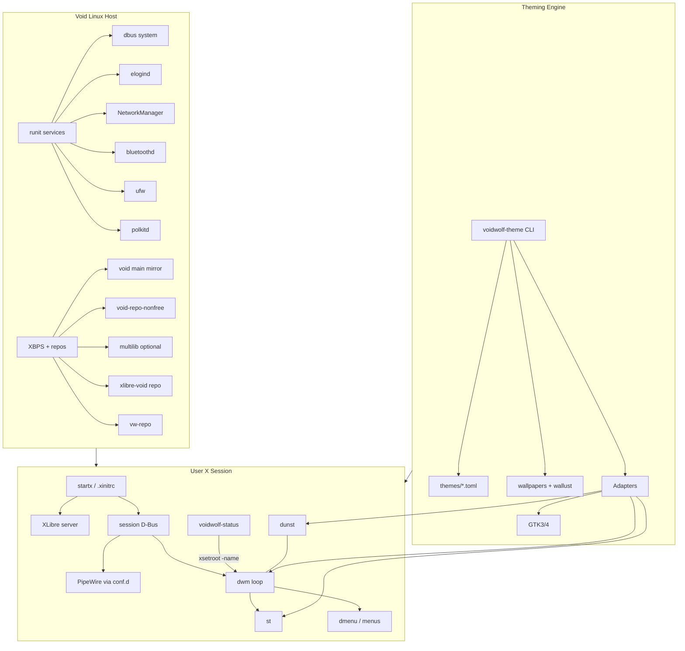
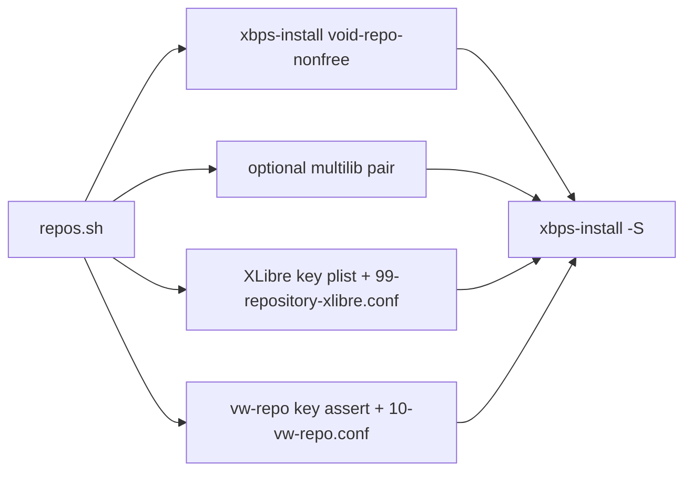
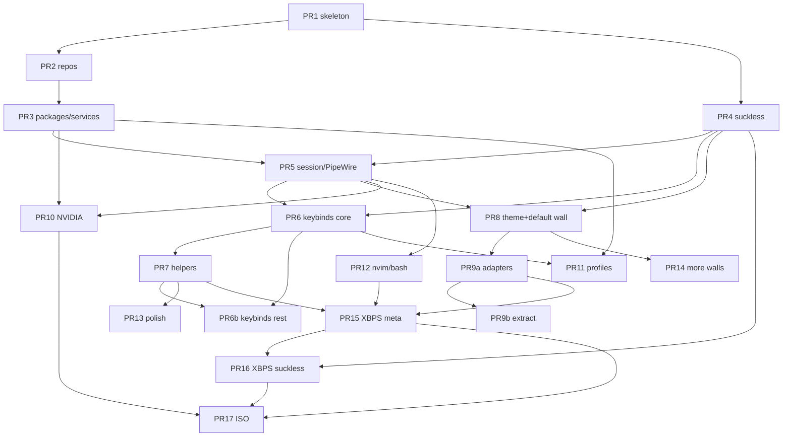

# voidwolf — Personal Void Linux Desktop Distribution

| Field | Value |
|-------|--------|
| **Document** | Architecture & Design Specification |
| **Author** | voidwolf project (Graewolf) |
| **Date** | 2026-07-31 |
| **Status** | **Approved** (revision 5 — open questions resolved) |
| **License** | MIT |
| **Hostname default** | `voidwolf` |
| **Workspace** | `/home/kmccuddy/.data/Projects/repos/voidwolf` |

---

## Overview

**voidwolf** is a personal, opinionated Void Linux desktop distribution/setup that adopts Omarchy’s *philosophy* — beautiful defaults, a paved path, developer-ready — without adopting Omarchy’s Hyprland/Arch stack or application bloat. The stack is deliberately lean: **Void Linux** (runit + XBPS), **XLibre** as the X server, **dwm** as the window manager, **st** as the terminal, **bash** + **neovim** + **brave-origin**, **PipeWire** audio, **NetworkManager**, Bluetooth, and **first-class NVIDIA** support.

Delivery evolves in deliberate phases: lean scripts and vendored suckless sources first, then custom XBPS packages, then a live ISO/installer. Theming is a first-class subsystem: 4–5 named presets plus wallpaper-driven palette extraction, with adapters for st, dwm, GTK, dmenu, dunst, and related tools. Keybindings track Omarchy’s Super/Mod4 map as closely as dwm allows; intentional gaps (grouping, dwindle, universal Super+C/V clipboard) are documented rather than papered over.

This document is the Phase 0 deliverable: sufficient technical detail for an engineer to implement bootstrap, theming, packaging, and session model without further architectural debate on locked decisions. Revisions 2–4 fixed session/repo/theming, PREFIX, focusdir, and Super+L binds. **Revision 5** incorporates final owner answers: Phase 3 ships vanitygaps + scratchpad + sticky by default; wallpaper extractor order **wallust → matugen → pywal** is locked; Phase 5 ISO details deferred until packaging (PR15–16) works.

---

## Background & Motivation

### Why voidwolf

Stock Void is an excellent base (rolling, musl/glibc choice, runit clarity, XBPS) but offers no guided desktop story. Omarchy demonstrates how powerful a *paved path* can be for daily developer machines — but it is Arch + Hyprland + a large curated app set. voidwolf exists for users who want:

1. **Void’s operational model** (runit services, XBPS, nonfree opt-in) rather than systemd/pacman.
2. **Classic X11 + suckless** (XLibre + dwm + st) rather than Wayland/Hyprland.
3. **Omarchy-grade ergonomics** (consistent Super keybinds, theme engine, menus, lock, screenshots) without importing Omarchy’s package surface.
4. **Personal ownership**: MIT-licensed, vendored suckless trees, user-controlled XBPS repos (`vw-repo` for Brave, community XLibre).

### Current state

The repository is empty. There is no installer, no packages, no config tree. Implementation starts from this design and a bootstrap script targeting an already-installed Void glibc x86_64 system.

### Pain points addressed

| Pain | voidwolf answer |
|------|-----------------|
| Blank Void desktop after install | Bootstrap + `.xinitrc` session that “just works” |
| Inconsistent theming across st/dwm/GTK | Canonical TOML themes + `voidwolf-theme` adapters |
| dwm default Alt (Mod1) binds | Full Mod4 Omarchy-inspired remap |
| NVIDIA + hybrid laptops on Void | Explicit install profiles (desktop discrete, laptop PRIME / RandR) |
| Brave not in official Void | Wire `vw-repo` into bootstrap (`brave-origin` verified in x86_64) |
| Xorg vs XLibre fork path | First-class XLibre community repo wiring |
| Theme switch requires manual rebuild | Generate headers / Xresources + dwm re-exec after rebuild |

---

## Goals & Non-Goals

### Goals

1. **Phase 1–3 usable desktop** on an existing Void install: login via `startx`, dwm session, themed st/dmenu/dunst, PipeWire, NetworkManager, Bluetooth, NVIDIA path documented and scripted.
2. **Theming engine** with named presets and wallpaper extraction; st via `xrdb` (new windows); dwm via generate → rebuild → re-exec.
3. **Keybind parity** with Omarchy critical binds (see mapping table); document unsupported Hyprland-only features and deliberate omissions.
4. **Hardware profiles**: laptop (power, brightness, hybrid GPU) and desktop (discrete NVIDIA).
5. **Packaging path**: scripts → `voidwolf-*` XBPS packages → ISO (later phases).
6. **Lean opinionated defaults**: developer-ready (neovim, terminal-first) without Omarchy’s full SaaS app grid.

### Non-Goals

- Replicating Omarchy’s full app list (HEY, Typora, Signal, Spotify defaults, etc.).
- Wayland / Hyprland / compositor-as-WM.
- Full disk encryption story in the installer (explicitly out of scope for Phase 5 initial design). **Implication:** voidwolf install/bootstrap leaves the disk at rest unprotected; users who need encryption must set up LUKS (or equivalent) *before* or outside voidwolf’s installer story.
- `doas` as the privilege tool (use **sudo**).
- Display manager / greeter (startx only).
- Supporting every NVIDIA legacy branch equally; focus on modern `nvidia` + documented legacy packages (`nvidia580`, `nvidia470`, `nvidia390` noted).
- musl as primary target for Phase 1–4 (glibc x86_64 first; musl may be investigated later).
- Replacing XBPS or runit.
- Running the graphical session or `startx` as root (forbidden; bootstrap refuses if `EUID=0` for session steps).

---

## Key Decisions

| Decision | Choice | Rationale |
|----------|--------|-----------|
| Base OS | Void Linux (runit, XBPS), glibc x86_64 first | User preference; clear service model; rolling + nonfree split |
| X server | XLibre via xlibre-void; Phase 1 meta **`xlibre-minimal`** + required tools/drivers | Lean default; add video packages as needed; full `xlibre` optional later |
| WM / terminal | dwm + st (vendored source) | Suckless control surface for theming and keybinds |
| Login | startx / `.xinitrc` only | Minimal; no greeter |
| Auto-startx on tty1 | **Default OFF** | Opt-in via documented `.bash_profile` snippet only |
| Shell / editor / browser | bash, neovim, brave-origin | Brave via `vw-repo`; package verified: `brave-origin-1.93.128_1.x86_64.xbps` (also hosts obsidian) |
| Audio / net / BT | PipeWire (user session), NetworkManager, BlueZ + TUI | Handbook-correct PipeWire conf.d + session bus |
| Session manager | **elogind** (required Phase 1) | `XDG_RUNTIME_DIR`, `loginctl`, device ACLs, polkit paths |
| GPU | NVIDIA proprietary first-class | Desktop discrete + laptop PRIME; RandR 1.4 alternative documented |
| Security baseline | ufw + sudo; no FDE in installer | See Security section for sudoers.d / `ufw --force` |
| Status bar | Native dwm bar + **`voidwolf-status`** (shell → `xsetroot -name`) | Phase 1 default; slstatus optional later, not vendored in Phase 1 |
| Compositor | **picom default OFF** | Avoid NVIDIA vsync/tearing fights; opt-in |
| Lock | **xsecurelock** preferred; slock fallback if unpackaged | PAM-friendly default |
| Wallpaper extractor | **wallust → matugen → pywal** (automatic fallback at PR9b) | wallust preferred; if not in Void repos, try next without user prompt |
| Theming | TOML schema + adapters + wallpaper extraction | Single source of truth |
| Fonts in themes | **Not themed** — fonts live in suckless `config.h` / fontconfig | Palette-only themes keep schema simple |
| Keybinds | Mod4 Omarchy-inspired map | Document dwm limits and deliberate non-maps |
| Suckless install prefix (Phase 1–3) | **`PREFIX=$HOME/.local`** (user-owned) | Theme rebuild/re-exec needs **no sudo**; `~/.local/bin` first on PATH |
| Phase 1 suckless patches | **Locked** (see below) | No further debate before PR4 |
| Phase 3 dwm patches (planned defaults) | **vanitygaps + scratchpad + sticky** | Not Phase 1; **will** ship as Phase 3 defaults (not “maybe”) |
| Delivery | Scripts → XBPS → ISO | Ship value early; Phase 4 personal/local XBPS; Phase 5 ISO after packaging works |
| License / hostname | MIT / `voidwolf` | Locked product identity |

### Locked Phase 1 suckless patch set

| Tree | Patches (apply in `patches/` order documented in each tree) |
|------|---------------------------------------------------------------|
| **dwm** | `actualfullscreen` (or equivalent toggle full-screen), `restartsig` **or** `selfrestart` (re-exec after rebuild — **not** a color hot-reload), `movestack`, **`focusdir`** (or equivalent directional focus so Super+Arrows and H/L are true directional focus). Systray **not** in Phase 1. **Phase 3 planned defaults (not Phase 1):** vanitygaps, scratchpad, sticky — implement and enable Super+S / Super+O (and gaps toggles) in Phase 3. |
| **st** | `xresources`, `scrollback` (and clipboard if separate patch). Optional live-reload/`USR1` **not** Phase 1. |
| **dmenu** | Minimal; **colors primarily via CLI wrapper** (`-nb/-nf/-sb/-sf`). Optional center/xyw later. **Precedence: CLI args override `config.h` colors at runtime.** |

### Suckless install prefix (locked)

| Phase | Install location | Who owns rebuild |
|-------|------------------|------------------|
| **1–3** | `PREFIX=$HOME/.local` → binaries in `~/.local/bin`, optional man under `~/.local/share/man` | User only; **`voidwolf-theme build-suckless` never uses sudo** |
| **4+** | XBPS may install system-wide (`/usr/bin` or `/usr/local` via package) | Package updates system copies; **user rebuild still targets `~/.local`** when present |

**PATH policy (bash config, Phase 1):**

```bash
# config/bash — ensure user suckless + voidwolf scripts win
export PATH="$HOME/.local/bin:$PATH"
```

`build-suckless.sh` and each `suckless/*/build.sh`:

```bash
export PREFIX="${PREFIX:-$HOME/.local}"
make clean
make
make install    # NO sudo — PREFIX is user-writable
```

**Theme apply path:** generate `colors.h` under the dwm source tree (or copy into it) → `make -C suckless/dwm PREFIX=$HOME/.local install` if palette hash changed → re-exec `dwm` from `PATH` (resolves to `~/.local/bin/dwm`). Password prompts mid-theme-switch are a **bug**, not expected UX.

**Phase 4 coexistence:** if both `/usr/bin/dwm` (package) and `~/.local/bin/dwm` exist, PATH order prefers user-local so themed rebuilds still win without root. Document `hash -r` / re-login if a stale shell cached the system path.

### Focus / Super+K policy (locked)

| Bind | Action | Mechanism |
|------|--------|-----------|
| Super+Left / Down / Up / Right | Focus client in that direction | **`focusdir`** |
| Super+H / Super+L | Focus left / right | **`focusdir`** — **Super+L is focus-right only** (not layout) |
| Super+J | Focus down (or next-in-stack if no client below — patch-defined) | **`focusdir` down** (not Omarchy layout-flip) |
| Super+K | Cheatsheet only | `spawn voidwolf-cheatsheet` — **never** focus-up |
| Super+Shift+L | Cycle layouts (tile → monocle → …) | **`setlayout` / layout cycle** — voidwolf substitute for Omarchy Super+L |
| Super+Shift+H/J + arrows (not L alone for layout) | Swap/move via movestack | `movestack` / swap |

**Single assignment rule:** Super+L is **never** layout cycle. Omarchy Super+J layout-flip remains **Unsupported**. voidwolf Super+J is directional focus down.

---

## Proposed Design

### High-level architecture



### Repository layout

```
voidwolf/
├── README.md
├── LICENSE                     # MIT
├── Makefile
├── docs/
│   ├── design.md
│   ├── keybindings.md
│   ├── theming.md
│   ├── nvidia.md
│   ├── repos.md                # fingerprints, key import, fail-closed
│   └── hardware-profiles.md
├── bin/
│   ├── voidwolf-theme
│   ├── voidwolf-menu
│   ├── voidwolf-system-menu
│   ├── voidwolf-launcher
│   ├── voidwolf-lock
│   ├── voidwolf-screenshot
│   ├── voidwolf-status         # Phase 1 default status → xsetroot -name
│   ├── voidwolf-cheatsheet
│   ├── voidwolf-wallpaper
│   ├── voidwolf-session-hook
│   ├── voidwolf-prime          # prime-run wrapper
│   ├── voidwolf-gpu-check      # recommend GPU profile
│   └── voidwolf-doctor         # Phase 3 support bundle
├── config/
│   ├── bash/
│   ├── neovim/
│   ├── dunst/
│   ├── gtk-3.0/
│   ├── gtk-4.0/
│   ├── fontconfig/
│   ├── pipewire/pipewire.conf.d/   # handbook symlinks template
│   ├── NetworkManager/
│   └── X11/
│       ├── .xinitrc
│       ├── .Xresources
│       └── xorg.conf.d/
├── themes/
│   ├── schema.toml.example
│   ├── voidwolf-dark.toml
│   ├── gruvbox.toml
│   ├── catppuccin-mocha.toml
│   ├── nord.toml
│   └── rose-pine.toml
├── wallpapers/
│   ├── voidwolf-default.jpg    # ships with theme MVP (PR8)
│   └── ...
├── suckless/
│   ├── dwm/   # config.h, colors.h GENERATED, patches/, build.sh
│   ├── st/
│   └── dmenu/
├── bootstrap/
│   ├── bootstrap.sh
│   ├── repos.sh
│   ├── packages-base.txt
│   ├── packages-desktop-required.txt
│   ├── packages-desktop-optional.txt
│   ├── packages-build-suckless.txt
│   ├── packages-laptop.txt
│   ├── packages-nvidia-desktop.txt
│   ├── packages-nvidia-laptop.txt
│   ├── enable-services.sh
│   ├── install-dotfiles.sh
│   ├── setup-pipewire.sh
│   └── build-suckless.sh
├── packages/                   # Phase 4 XBPS templates
├── iso/                        # Phase 5
└── tests/
    ├── theme-schema-validate.sh
    └── keybind-lint.sh
```

### Runit / startx session model

voidwolf separates **system services** (runit) from the **user graphical session** (startx → XLibre → session D-Bus → PipeWire + dwm). There is no display manager.

```mermaid
sequenceDiagram
  participant Boot as runit stage 1-3
  participant Login as getty / TTY login
  participant User as bash login shell
  participant SX as startx
  participant XL as XLibre
  participant Init as .xinitrc
  participant DB as dbus-run-session
  participant WM as dwm loop

  Boot->>Boot: dbus, elogind, NetworkManager, bluetoothd, polkitd, ufw
  Boot->>Login: agetty on tty1
  Login->>User: login (elogind session; XDG_RUNTIME_DIR set)
  User->>SX: startx (manual; auto-startx OFF by default)
  SX->>XL: X server start
  SX->>Init: run ~/.xinitrc
  Init->>Init: xrdb, env exports
  Init->>DB: dbus-run-session / session bus ensure
  Init->>Init: pipewire & only (WP + pulse via conf.d)
  Init->>Init: dunst, voidwolf-status, wallpaper
  Init->>WM: while true; do dwm && break; done
  Note over WM: re-exec dwm after theme rebuild; exit non-zero/break ends X
```

#### System services (runit)

| Service | Package / notes |
|---------|-----------------|
| `dbus` | **Required** — system bus |
| `elogind` | **Required** — seat, `XDG_RUNTIME_DIR`, `loginctl`, device ACLs |
| `NetworkManager` | Networking |
| `bluetoothd` | BlueZ |
| `polkitd` | **Required** for desktop profile (NM/BT privilege paths) |
| `ufw` | Host firewall |
| `chronyd` or `ntpd` | Prefer image default |
| NVIDIA | DKMS modules on kernel install; **`nvidia-persistenced` out of scope** (not enabled by default) |

#### Session stack (elogind + D-Bus + XDG_RUNTIME_DIR)

**Phase 1 locked:**

1. Install and enable **`elogind`** (and `dbus`) per Void handbook; user must re-login after first enable so the seat session is active.
2. After login, `echo $XDG_RUNTIME_DIR` should be `/run/user/$(id -u)` (mode `700`). If missing, PipeWire and several desktop components fail.
3. Graphical session must have a **session D-Bus**. Preferred pattern in `.xinitrc`:

```bash
# Ensure session bus (Void bare-WM pattern)
if [ -z "$DBUS_SESSION_BUS_ADDRESS" ]; then
  eval "$(dbus-launch --sh-syntax --exit-with-session)"
fi
# Export X vars into systemd/user-less activation where applicable
dbus-update-activation-environment --systemd DISPLAY XAUTHORITY XDG_CURRENT_DESKTOP 2>/dev/null || \
  dbus-update-activation-environment DISPLAY XAUTHORITY
```

Alternatively wrap the WM side with `dbus-run-session` when launching the session loop (equivalent goal: one session bus for PipeWire, dunst, portals later).

**Fallback (no elogind — not Phase 1 default):** document only for recovery: membership in `audio`/`video`/`input`; manually `mkdir -p /run/user/$(id -u) && chmod 700 …` and export `XDG_RUNTIME_DIR`. Suspend via `zzz` instead of `loginctl`. Not supported as a first-class profile.

#### PipeWire (Void handbook model)

**Do not** start `wireplumber` and `pipewire-pulse` as sibling background jobs. Bootstrap / `setup-pipewire.sh` creates handbook conf.d links so **`pipewire` alone** spawns the rest:

```bash
# User-level (preferred for voidwolf install-dotfiles):
mkdir -p ~/.config/pipewire/pipewire.conf.d
ln -sf /usr/share/examples/wireplumber/10-wireplumber.conf \
  ~/.config/pipewire/pipewire.conf.d/10-wireplumber.conf
ln -sf /usr/share/examples/pipewire/20-pipewire-pulse.conf \
  ~/.config/pipewire/pipewire.conf.d/20-pipewire-pulse.conf
# Exact example paths follow Void package layout at implementation time;
# setup-pipewire.sh discovers them with a small fallback search.
```

ALSA: install `alsa-pipewire` and enable the handbook ALSA conf drop-in so ALSA clients hit PipeWire.

`.xinitrc` audio line:

```bash
pipewire &
# wireplumber + pipewire-pulse started by pipewire via conf.d — do not double-start
```

#### `.xinitrc` (canonical excerpt)

```bash
#!/bin/sh
# config/X11/.xinitrc — voidwolf
export XDG_SESSION_TYPE=x11
export XDG_CURRENT_DESKTOP=voidwolf

# Safety: never as root
if [ "$(id -u)" -eq 0 ]; then
  echo "voidwolf: refusing to start X session as root" >&2
  exit 1
fi

# Session bus + activation env (see above)
if [ -z "$DBUS_SESSION_BUS_ADDRESS" ]; then
  eval "$(dbus-launch --sh-syntax --exit-with-session)"
fi
dbus-update-activation-environment DISPLAY XAUTHORITY XDG_CURRENT_DESKTOP 2>/dev/null || true

# Xresources: static base + generated theme
[ -f "$HOME/.Xresources" ] && xrdb -merge "$HOME/.Xresources"
[ -f "$HOME/.config/voidwolf/generated/theme.Xresources" ] && \
  xrdb -merge "$HOME/.config/voidwolf/generated/theme.Xresources"

# Optional HiDPI (see Multi-monitor / HiDPI)
# xrdb -merge <<< "Xft.dpi: 96"

pipewire &

dunst &
voidwolf-status &
# picom -b &   # default OFF

voidwolf-wallpaper restore &

# Session loop: clean quit (exit 0) ends X; crash restarts dwm.
# Theme rebuild uses restartsig in-process exec (not this loop).
while true; do
  dwm && break
done
```

**Auto-startx:** default **OFF**. Opt-in only:

```bash
# optional ~/.bash_profile
if [ -z "$DISPLAY" ] && [ "$(tty)" = /dev/tty1 ]; then
  exec startx
fi
```

#### Session lifecycle rules

1. **Single seat, single X** in Phase 1.
2. **dwm exit 0** (Super+Shift+Q / intentional logout) → leave loop → X ends → TTY. **dwm non-zero** (crash) → restart dwm, keep X. Theme rebuild uses restartsig/selfrestart **in-process** (`exec`), not the shell loop.
3. **Lock** does not stop services; `voidwolf-lock` uses **xsecurelock** (or slock fallback).
4. **Suspend**: system menu **default path is lock-then-suspend** (`voidwolf-lock` then `loginctl suspend`, or `zzz` if loginctl unavailable). Separate “Suspend without lock” is not offered in Phase 1.
5. **Theme switch**: generate artifacts → hash short-circuit rebuild of dwm if `colors.h` changed → re-exec dwm; `xrdb` for st (**new terminals only** unless USR1 patch later).

### Bootstrap: wiring repos and packages

#### Repository enablement (`bootstrap/repos.sh`)



**1. Official nonfree (idiomatic Void)**

```bash
# Uses the system's configured mirror — do NOT hard-code repo-default
sudo xbps-install -y void-repo-nonfree
```

**2. Multilib (optional, gated)**

Required only for 32-bit NVIDIA libs / Steam-class gaming:

```bash
# bootstrap flag: --with-32bit
sudo xbps-install -y void-repo-multilib void-repo-multilib-nonfree
```

Do **not** install `nvidia-libs-32bit` unless `--with-32bit` is set.

**3. XLibre community repo** ([xlibre-void/xlibre](https://github.com/xlibre-void/xlibre))

```bash
# Fail closed: expected fingerprint filename must match
EXPECTED_XLIBRE_KEY='00:ca:42:57:c9:c0:9a:ec:94:b4:7d:97:e5:a9:aa:1e.plist'
sudo wget -O "/var/db/xbps/keys/${EXPECTED_XLIBRE_KEY}" \
  "https://github.com/xlibre-void/xlibre/raw/refs/heads/main/repo-keys/x86_64/${EXPECTED_XLIBRE_KEY}"
# Verify SHA256 of key file against pin in docs/repos.md; abort on mismatch

printf 'repository=https://github.com/xlibre-void/xlibre/releases/latest/download/\n' \
  | sudo tee /etc/xbps.d/99-repository-xlibre.conf
```

**Phase 1 package pin:** install **`xlibre-minimal`** plus explicit tools needed for startx/dwm (`xauth`, `xsetroot`, `xrdb`, `setxkbmap`, `xrandr`, etc. — listed in `packages-desktop-required.txt`). Full meta `xlibre` is opt-in via `--xlibre-full` if the community meta pulls useful video drivers for non-NVIDIA.

**Proprietary NVIDIA vs XLibre video packages:** Void `nvidia` is **out-of-tree DKMS + binary GLX**, not an `xlibre-video-*` package. XLibre’s modesetting/nouveau/amdgpu packages are separate. For discrete NVIDIA, X uses the proprietary module; for hybrid PRIME, **iGPU modesetting (intel/amdgpu) is the primary X provider** and NVIDIA is the offload sink.

**Install order (NVIDIA + XLibre):**

1. `linux-headers` matching running kernel, `dkms`, `void-repo-nonfree`
2. `nvidia` / `nvidia580` / `nvidia470` / `nvidia390` as family dictates
3. Blacklist nouveau (package usually ships modprobe snippet)
4. `nvidia-drm.modeset=1` (modprobe.d or cmdline)
5. XLibre (`xlibre-minimal` + tools)
6. Reboot before first `startx` when modules were just built
7. Validate: `voidwolf-gpu-check`, `nvidia-smi`, `glxinfo`

**`--allow-xorg-fallback` (recovery only):**

```bash
# Conceptual recovery (exact package names confirmed at implementation):
# 1. Remove xlibre packages that conflict with xorg-server
sudo xbps-remove -R xlibre-minimal  # and related xlibre-* as installed
# 2. Reinstall stock Xorg
sudo xbps-install -y xorg-minimal xorg-server
# 3. Disable community repo temporarily
sudo mv /etc/xbps.d/99-repository-xlibre.conf{,.disabled}
sudo xbps-install -S
# 4. Keep nvidia packages; ensure Device section still Driver "nvidia" or modesetting as needed
```

Document full command list in `docs/nvidia.md`. May need `xbps-install -f` when files conflict during switch. Bootstrap never falls back silently.

**4. vw-repo (brave-origin)** ([codeberg.org/Graewolf/vw-repo](https://codeberg.org/Graewolf/vw-repo))

**Verified packages (x86_64):** `brave-origin` (e.g. `brave-origin-1.93.128_1.x86_64.xbps`) and `obsidian` are present in the repo tree. Browser default remains **`brave-origin`**.

**Key import (XBPS-correct, fail-closed):**

Upstream README’s `curl …/vw-repo.pub | tee /var/db/xbps/keys/vw-repo.pub` is **not** sufficient as a trusted key layout by itself (XBPS expects fingerprint-named `.plist` under `/var/db/xbps/keys/`, or interactive trust on first sync). voidwolf `repos.sh` will:

1. Ship or generate a **fingerprint-named `.plist`** for the vw-repo signing key (conversion from PEM documented in `docs/repos.md`; fingerprint pin committed in-repo, same style as xlibre-void).
2. **Assert** installed key fingerprint matches the pin; **abort** on mismatch (fail closed).
3. Write repo conf (note: use valid `https://` URL — avoid upstream README typo `https:/`):

```bash
printf 'repository=https://codeberg.org/Graewolf/vw-repo/raw/branch/main/x86_64\n' \
  | sudo tee /etc/xbps.d/10-vw-repo.conf
sudo xbps-install -S
sudo xbps-install -y brave-origin   # unless --no-brave
```

4. Phase 4+ CI smoke: container `xbps-install -S` against vw-repo + query `brave-origin`.

#### Bootstrap entrypoint

```bash
./bootstrap/bootstrap.sh \
  --profile desktop|laptop \
  [--gpu nvidia|nvidia-hybrid|nvidia-hybrid-randr|none] \
  [--with-32bit] \
  [--no-brave] \
  [--xlibre-full] \
  [--allow-xorg-fallback] \
  [--with-picom]
```

Steps:

1. Assert non-confusing environment: Void, x86_64, network; session install steps refuse root-as-target-user confusion.
2. `repos.sh` — void-repo-nonfree, optional multilib, XLibre + vw-repo keys (**fail closed**), `xbps-install -S`.
3. Install package lists: base → desktop-required → optional best-effort → build-suckless → profile → gpu.
4. `enable-services.sh` — dbus, elogind, NetworkManager, bluetoothd, polkitd, ufw.
5. Groups: `wheel`, `network`, `bluetooth`, `video`, `audio`, `input` as needed.
6. **sudoers:** drop `/etc/sudoers.d/voidwolf-wheel` (`%wheel ALL=(ALL:ALL) ALL`) via install that is visudo-safe (or `visudo -cf` check). Void’s default often leaves wheel commented in main sudoers.
7. `setup-pipewire.sh` — conf.d links + ALSA.
8. `build-suckless.sh` → **`PREFIX=$HOME/.local`** (no sudo); ensure bash PATH puts `~/.local/bin` first.
9. `install-dotfiles.sh`; `voidwolf-theme set voidwolf-dark` (rebuilds dwm user-local if needed).
10. ufw: default deny incoming, allow outgoing; **`ufw --force enable`** (non-interactive).
11. Print re-login + `startx` next steps (auto-startx still OFF).

#### Package lists

**`packages-build-suckless.txt` (required for PR4 builds)**

- `base-devel` (or explicit `gcc`, `make`, `pkg-config`)
- `libX11-devel`, `libXft-devel`, `libXinerama-devel`, `freetype-devel`, `fontconfig-devel`

**`packages-desktop-required.txt`**

- `xlibre-minimal` (+ listed X tools: `xrdb`, `xsetroot`, `xset`, `setxkbmap`, `xrandr`, `xauth`, `xclip`, `xdotool`, `maim`)
- `elogind`, `dbus`, `polkit`
- `pipewire`, `wireplumber`, `pipewire-pulse`, `alsa-pipewire`
- `NetworkManager`, `bluez` (+ PipeWire BT plugin package as named on Void)
- `dunst`, `xsecurelock` (if missing, optional list tries `slock`)
- `neovim`, `bash-completion`, `git`, `curl`, `ripgrep`, `fd`, `btop`
- `ufw`, `sudo`
- `font-*-ttf` / JetBrains Mono or DejaVu + emoji as available
- Wallpaper: **`feh`** or **`xwallpaper`** (prefer `xwallpaper` if present; one required)
- `mesa-dri`, `glxinfo` (validation; mesa for non-NVIDIA / hybrid iGPU)

**`packages-desktop-optional.txt` (best-effort; skip if not in repos)**

- Nicer TUIs: `pulsemixer` (preferred audio TUI if packaged), `bluetuith` / similar — **fallback required path uses `bluetoothctl` and `nmtui` (from NetworkManager)**
- `picom` (only installed if `--with-picom`)
- `ImageMagick`, `wallust` / `matugen` / `python3-pywal` for extraction
- `lf`, `clipmenu`, `arandr`
- Omarchy-like names (`wiremix`, `bluetui`, `impala`) **only if** `xbps-query -Rs` finds them; never hard-fail bootstrap

**TUI bind defaults (resolved at runtime by helper scripts):**

| Bind | Preferred | Fallback |
|------|-----------|----------|
| Super+Ctrl+A | `pulsemixer` | `wpctl` status + simple dmenu volume |
| Super+Ctrl+B | `bluetuith` if installed | `bluetoothctl` in `st` |
| Super+Ctrl+W | `nmtui` | NetworkManager CLI message |
| Super+Ctrl+T | `btop` | `top` |

**NVIDIA lists:** include `linux-headers`, `dkms`, and the selected `nvidia*` package; 32-bit libs only with `--with-32bit`.

**Browser:** `brave-origin` from vw-repo (required unless `--no-brave`).

### dwm / st management

#### Vendoring

- Snapshot upstream under `suckless/{dwm,st,dmenu}/` with `VERSION` + ordered `patches/`.
- `build.sh` applies patches, then `make && make install` with **`PREFIX=${PREFIX:-$HOME/.local}`** — **never sudo** in Phase 1–3.
- **`colors.h` (dwm) is GENERATED** by `voidwolf-theme` — never hand-edit.
- `config.h` holds keybinds, **fonts**, rules — versioned in git (fonts are not part of theme TOML).

#### Theming integration for suckless (Phase 2 locked behavior)

| Component | Mechanism | Apply UX |
|-----------|-----------|----------|
| **st** | Xresources via xresources patch | `xrdb -merge` on theme set. **Existing st windows keep old colors** until restarted. New `st` instances pick up palette. Optional USR1 live-reload patch is Phase 3+. Binary: `~/.local/bin/st`. |
| **dwm** | Generate `colors.h` → `make PREFIX=$HOME/.local install` if hash changed → **re-exec** dwm | restartsig/selfrestart re-executes the **new** user-local binary. **No sudo.** **HUP alone does not reload colors from source.** Default `.xinitrc` `while` loop makes re-exec safe. |
| **dmenu** | `voidwolf-launcher` / menus pass `-nb -nf -sb -sf` (and font if desired) | **No rebuild.** **CLI color args override `config.h` colors.** Binary: `~/.local/bin/dmenu` (and `dmenu_run`). |

`voidwolf-theme build-suckless` behavior (locked):

1. Write generated `colors.h` into the dwm source tree.  
2. Compare palette/content hash to `$VOIDWOLF_HOME/generated/colors.hash`.  
3. If changed: `make -C "$VOIDWOLF_ROOT/suckless/dwm" PREFIX="$HOME/.local" install` (user-writable; **abort if PREFIX not writable — do not escalate to sudo**).  
4. Update hash file; signal dwm re-exec (restartsig/selfrestart or kill for the `.xinitrc` loop).  
5. st binary rebuild is **not** required for palette-only changes (xrdb); rebuild st only if `build-suckless --all` or st `config.h` changed.

**Performance targets**

| Path | Target |
|------|--------|
| Theme apply without dwm rebuild (hash match) | p95 < 1s (xrdb + file adapters) |
| Theme apply with **warm** dwm rebuild (ccache / existing `.o`, **no sudo**) | p95 < 5s including re-exec |
| Cold rebuild (clean tree) | Multi-second; **not** subject to 500 ms claim; document separately |
| st new window after xrdb | Immediate on next spawn |

Enable `ccache` in `build-suckless.sh` when available to hit warm-path targets.

### Keybindings: Omarchy → dwm mapping

**Source of truth for Omarchy:** [Omarchy Hotkeys](https://learn.omacom.io/2/the-omarchy-manual/53/hotkeys).  
**voidwolf policy:** Mod4 (Super) for WM binds; stock Mod1 WM binds removed. Alt+Tab retained for window cycle.

#### Status legend

| Status | Meaning |
|--------|---------|
| **Supported** | Implemented natively or via simple external script |
| **Partial** | Approximate behavior; UX differs from Omarchy |
| **Unsupported** | No good dwm/X11 equivalent in voidwolf scope |

#### Critical & system mapping

| Omarchy bind | Omarchy action | voidwolf (dwm) | Status | Implementation notes |
|--------------|----------------|----------------|--------|----------------------|
| Super+Space | App launcher | Super+Space | Supported | `voidwolf-launcher` → `dmenu_run` |
| Super+Alt+Space | Control menu | Super+Alt+Space | Supported | `voidwolf-menu` |
| Super+Escape | System menu | Super+Escape | Supported | lock, lock+suspend, reboot, poweroff, logout |
| Super+Ctrl+L | Lock | Super+Ctrl+L | Supported | `voidwolf-lock` (xsecurelock) |
| Super+W | Close window | Super+W | Supported | `killclient` |
| Super+T | Toggle float | Super+T | Supported | `togglefloating` |
| Super+F | Fullscreen | Super+F | Supported | `togglefullscr` via actualfullscreen |
| Super+Return | Terminal | Super+Return | Supported | `st` |
| Super+Shift+Return | Browser | Super+Shift+Return | Supported | `brave-origin` |
| Super+1–9 | Workspace | Super+1–9 | Supported | tags 1–9 |
| Super+Shift+1–9 | Move to workspace | Super+Shift+1–9 | Supported | `tag` |
| Super+Arrows | Focus by direction | Super+Arrows | **Supported** | **`focusdir`** patch (Phase 1 locked) |
| Super+H / L | (Omarchy: grow / other) | Super+H / L | **Supported** | **`focusdir`** left / right |
| Super+J | Toggle window position H/V | Super+J | **Partial** | **Omarchy layout-flip Unsupported.** voidwolf: **`focusdir` down** (not focusstack duplicate of L) |
| Super+K | Cheatsheet (Omarchy) | Super+K | Supported | `voidwolf-cheatsheet` only — **not** focus-up / focusdir up |
| Super+Shift+Arrows / movestack | Swap | Super+Shift+H/J + arrows | Supported | movestack patch; **not** Super+Shift+L (reserved for layout cycle) |
| Super+Ctrl+Shift+Space | Theme picker | Super+Ctrl+Shift+Space | Supported | `voidwolf-theme pick` |
| Super+Ctrl+Space | Wallpaper picker | Super+Ctrl+Space | Supported | `voidwolf-wallpaper pick` |
| Super+Shift+N | Neovim | Super+Shift+N | Supported | `st -e nvim` |
| Super+Ctrl+A/B/W/T | Audio/BT/wifi/btop | same | Supported | helpers with package fallbacks |
| Super+C / V / X | Universal clipboard | — | Unsupported | See Appendix C |
| Super+Ctrl+V | Clipboard manager | Super+Ctrl+V | Partial | optional clipmenu Phase 3 |
| Super+Ctrl+C | Capture menu | Super+Ctrl+C | Supported | `voidwolf-screenshot` |
| Print | Screenshot | Print | Supported | maim + xclip |
| Super+G | Grouping | — | Unsupported | Hyprland-only |
| Super+L | Dwindle/scroll layout toggle | Super+L | **Partial** (chord remapped) | Omarchy Super+L = layout; voidwolf Super+L = **`focusdir` right** only (same as Super+Right) |
| — (voidwolf) | Layout cycle (tile/monocle/…) | **Super+Shift+L** | Supported | voidwolf substitute for Omarchy Super+L layout; master-stack cycle, not dwindle |
| Super+O | Sticky floating | Super+O | Partial → Supported in Phase 3 | **Phase 3 default:** sticky patch; unbound until Phase 3 |
| Super+S | Scratchpad | Super+S | Partial → Supported in Phase 3 | **Phase 3 default:** scratchpad patch; unbound until Phase 3 |
| Super+Tab | Next workspace | Super+Tab | Supported | cycle tags |
| Super+Shift+Tab | Previous workspace | Super+Shift+Tab | Supported | reverse cycle |
| Super+Ctrl+Tab | Former workspace | Super+Ctrl+Tab | Partial | toggle last tag set if implemented |
| Alt+Tab | Cycle windows | Alt+Tab | Supported | `focusstack` |
| Super+Shift+F | File manager | Super+Shift+F | Partial | `st -e lf` if lf installed |
| Super+Button1/3 | Drag/resize | same | Supported | Mod4 |
| Super+Equal/Minus | Grow master | Super+Equal/Minus | Supported | `setmfact` |
| Ctrl+Alt+Del | Close all windows | Ctrl+Alt+Del | Partial | careful script / restart dwm |
| Super+, | **Dismiss latest notification** | Super+, | Supported | `dunstctl close` (not history) |
| Super+Shift+, | Dismiss all | Super+Shift+, | Supported | `dunstctl close-all` |
| Super+Ctrl+, | Toggle silence | Super+Ctrl+, | Supported | `dunstctl set-paused toggle` |
| Super+Alt+, | Invoke most recent | Super+Alt+, | Partial | `dunstctl history-pop` if available |
| Multi-monitor | tagmon / focusmon | Super+,/. variants as docs | Partial | dwm native |
| Super+Shift+Space | Toggle top bar | Super+Shift+Space | Supported | `togglebar` |

#### Omarchy binds deliberately not mapped (long tail)

Out of scope for default voidwolf (document in `docs/keybindings.md`; user may add):

- Super+P pseudo tiling; Super+Alt+F full width; Super+Ctrl+F inner fullscreen  
- Super+G / grouping family; Hyprland dwindle/scroll semantics (voidwolf uses Super+Shift+L for simple layout cycle only)  
- Super+Ctrl+Z zoom; Super+/ monitor scaling  
- Super+Ctrl+I idle inhibit; Super+Ctrl+N nightlight; Super+Ctrl+Delete lid display  
- Super+Ctrl+R reminders; notice hotkeys; emoji CapsLock layer  
- SaaS app grid (HEY, Spotify, Signal, Typora, 1Password, …)  
- Tmux / Ghostty-specific binds (not default stack)  
- Super+C/V universal clipboard  

#### Intentional differences (summary)

1. **Tags ≠ workspaces** (bitmask tags).  
2. **Master-stack default**; **Super+Shift+L** cycles layouts (not Hyprland dwindle). **Super+L** is focus-right only.  
3. **No window grouping.**  
4. **Super+J** is **`focusdir` down**, not Omarchy position toggle; Super+H/L/Arrows are true directional focus via **focusdir** (Phase 1).  
5. **Super+K** is cheatsheet only (no focus-up on K; use Super+Up for focus up).  
6. **Universal clipboard unsupported** on X11 by default.  
7. **Mod1** freed except explicit Alt+Tab family (`focusstack`).

### Theming engine

#### CLI interface

```
voidwolf-theme — manage voidwolf color themes

Usage:
  voidwolf-theme list
  voidwolf-theme show [name]
  voidwolf-theme set <name>
  voidwolf-theme pick
  voidwolf-theme from-wallpaper <path> [--name derived-<slug>]
  voidwolf-theme reload
  voidwolf-theme build-suckless   # generate colors.h + user-local make install (no sudo)
  voidwolf-theme validate [path]
  voidwolf-theme current

Paths:
  VOIDWOLF_HOME   default $HOME/.config/voidwolf
  Themes search:  $VOIDWOLF_HOME/themes  →  $VOIDWOLF_ROOT/themes  →  /usr/share/voidwolf/themes
  State:          $VOIDWOLF_HOME/current/   (atomic updates via temp + rename)
  Generated:      $VOIDWOLF_HOME/generated/
```

Exit codes: `0` ok, `1` usage, `2` theme not found, `3` adapter failure, `4` schema invalid.

#### Theme TOML schema (canonical example)

```toml
# themes/voidwolf-dark.toml
schema_version = 1
name = "voidwolf-dark"
display_name = "Voidwolf Dark"
author = "voidwolf"
description = "Default dark theme — cool black with amber accent"

[palette]
bg = "#0b0c0e"
fg = "#e6e8eb"
cursor = "#e6e8eb"
accent = "#e6a23c"
urgent = "#f07178"
border_normal = "#2a2e35"
border_focused = "#e6a23c"
bar_bg = "#0b0c0e"
bar_fg = "#e6e8eb"
bar_selected_bg = "#e6a23c"
bar_selected_fg = "#0b0c0e"
color0  = "#0b0c0e"
color1  = "#f07178"
color2  = "#c3e88d"
color3  = "#ffcb6b"
color4  = "#82aaff"
color5  = "#c792ea"
color6  = "#89ddff"
color7  = "#e6e8eb"
color8  = "#4a5160"
color9  = "#f07178"
color10 = "#c3e88d"
color11 = "#ffcb6b"
color12 = "#82aaff"
color13 = "#c792ea"
color14 = "#89ddff"
color15 = "#ffffff"

[meta]
gtk_theme = "Adwaita-dark"
icon_theme = "Papirus-Dark"
cursor_theme = "Adwaita"
cursor_size = 24
# Relative wallpapers resolve against VOIDWOLF_ROOT then /usr/share/voidwolf
wallpaper = "wallpapers/voidwolf-default.jpg"

[options]
dwm_border_px = 2
dwm_showbar = true
picom_opacity_inactive = 1.0
```

#### Formal field table

| Field | Type | Required | Default | Used by |
|-------|------|----------|---------|---------|
| `schema_version` | int | **yes** | — | validate (must be `1`) |
| `name` | string | **yes** | — | state, list |
| `display_name` | string | no | `name` | pick UI |
| `author` | string | no | `""` | show |
| `description` | string | no | `""` | show |
| `palette.bg` | hex `#RRGGBB` | **yes** | — | all adapters |
| `palette.fg` | hex | **yes** | — | all |
| `palette.cursor` | hex | no | `fg` | st Xresources |
| `palette.accent` | hex | **yes** | — | borders, GTK css, dmenu selected |
| `palette.urgent` | hex | **yes** | — | dunst critical, dwm urgent |
| `palette.border_normal` | hex | no | darken(bg) | dwm |
| `palette.border_focused` | hex | no | `accent` | dwm |
| `palette.bar_bg` / `bar_fg` | hex | no | `bg`/`fg` | dwm bar |
| `palette.bar_selected_bg` / `bar_selected_fg` | hex | no | `accent`/`bg` | dwm |
| `palette.color0`–`color15` | hex | **yes** for presets | — | st; **required for `validate` on shipped themes** |
| `meta.gtk_theme` | string | no | `Adwaita-dark` | settings.ini ThemeName |
| `meta.icon_theme` | string | no | — | settings.ini |
| `meta.cursor_theme` / `cursor_size` | string/int | no | Adwaita/24 | Xcursor |
| `meta.wallpaper` | path | no | none | wallpaper adapter |
| `options.dwm_border_px` | int | no | 2 | colors.h / config note |
| `options.dwm_showbar` | bool | no | true | not hot-toggled by theme alone |
| `options.picom_opacity_inactive` | float | no | 1.0 | only if picom enabled |

**Fonts:** not in schema. Change fonts in `suckless/*/config.h` and fontconfig.

**Wallpaper path resolution order** for relative paths:

1. `$VOIDWOLF_ROOT/<path>` (repo checkout / install prefix)  
2. `/usr/share/voidwolf/<path>`  
3. Absolute paths used as-is  
4. Else adapter error (exit 3)

**`from-wallpaper` extraction contract**

- Backend order (**locked**): **wallust → matugen → pywal** (`wal`). At PR9b, probe availability in order and use the first working tool — no interactive “pick backend.” If wallust is not in Void repos, fall through automatically.  
- Must produce at least: `bg`, `fg`, `cursor`, `accent`, `urgent`, `border_*`, `bar_*`, and **all 16 ANSI colors** (templates must fill 16; if a backend returns fewer, derive color8–15 by lighten/dim of 0–7).  
- Writes `$VOIDWOLF_HOME/themes/derived-<slug>.toml` then applies.  
- `schema_version = 1`, `name = derived-<slug>`.

**Atomic state updates:** write `$VOIDWOLF_HOME/current/.tmp-*` then `rename(2)` into place for `name`, `wallpaper`, `palette.toml`.

#### Adapter templates (minimal)

**dunst** (`generated/dunstrc.colors` included from main dunstrc):

```ini
[global]
    frame_color = "{{ accent }}"

[urgency_low]
    background = "{{ bg }}"
    foreground = "{{ fg }}"

[urgency_normal]
    background = "{{ bg }}"
    foreground = "{{ fg }}"

[urgency_critical]
    background = "{{ bg }}"
    foreground = "{{ urgent }}"
    frame_color = "{{ urgent }}"
```

**GTK** — `settings.ini` sets theme/icon/cursor names from `meta.*`. Accent recolor via `generated/gtk.css` (GTK3) loaded if present:

```css
/* voidwolf generated — best-effort accent; does not replace full GTK themes */
@define-color accent_bg_color {{ accent }};
@define-color accent_fg_color {{ bar_selected_fg }};
```

GTK4 equivalent under `gtk-4.0/gtk.css`. Full Adwaita recolor is best-effort; named `gtk_theme` remains the primary switch.

**Xresources / st** — colors 0–15 + foreground/background/cursorColor.

**dwm `colors.h`** — norm/sel/urgent from palette; rebuild+re-exec.

### Menus and helper UX

- **voidwolf-launcher**: dmenu_run + theme CLI colors.  
- **voidwolf-menu**: Theme, Wallpaper, Displays (xrandr presets), Network, Bluetooth, Audio, Screenshots, Edit config, About.  
- **voidwolf-system-menu**: Lock; **Lock & Suspend** (default suspend path); Reboot; Poweroff; Logout (end dwm loop).  
- **voidwolf-cheatsheet**: keybind list.  
- **voidwolf-doctor** (Phase 3): kernel, xlibre/nvidia package versions, `echo $XDG_RUNTIME_DIR`, `sv status`, repo conf list, `nvidia-smi`/`glxinfo` snippets — support bundle to stdout.  
- **voidwolf-gpu-check**: lspci GPU family → recommended `--gpu` profile + driver package.

### NVIDIA install profiles

#### Profile matrix

| Profile flag | Hardware | Driver package | X primary GPU | Offload method | Power expectation | Notes |
|--------------|----------|----------------|---------------|----------------|-------------------|-------|
| `nvidia` | Discrete NVIDIA only | `nvidia` (Turing+), else `nvidia580` / `nvidia470` / `nvidia390` by family | NVIDIA | none | N/A | `Driver "nvidia"`; modeset=1 |
| `nvidia-hybrid` | iGPU + dGPU laptop | `nvidia` or `nvidia470` only for **PRIME Render Offload** per Void handbook | **iGPU modesetting** (intel/amdgpu) | `prime-run` / `__NV_PRIME_RENDER_OFFLOAD=1` | Pre-Turing may not fully power down dGPU | Preferred hybrid default |
| `nvidia-hybrid-randr` | iGPU + dGPU | `nvidia`, `nvidia470`, or `nvidia390` | Chosen at session start via RandR 1.4 | Session-wide GPU pick | Better chance to power down dGPU when on iGPU | When battery > per-app offload |
| `none` | Intel/AMD only | mesa | iGPU | — | — | |

**Family → package (discrete or hybrid):**

| Family | Package | PRIME Render Offload (handbook) | Hybrid note |
|--------|---------|----------------------------------|-------------|
| Turing+ | `nvidia` | Yes | Prefer `nvidia-hybrid` |
| Maxwell–Volta | `nvidia580` | **Not listed** for PRIME offload on Void Optimus page | Prefer **`nvidia-hybrid-randr`** or test; do not assume prime-run |
| Kepler | `nvidia470` | Yes | PRIME offload OK |
| Fermi | `nvidia390` | No PRIME offload in handbook | RandR 1.4 or **nouveau / unsupported proprietary path** |
| Older | — | — | **nouveau** or unsupported; `voidwolf-gpu-check` says so |

**Hybrid X configuration principles**

- Primary Device is **modesetting** on iGPU; NVIDIA is secondary for offload.  
- Multi-GPU Device sections as required by NVIDIA PRIME docs; XLibre path validated with `voidwolf-gpu-check` after first graphical login.  
- External HDMI/DP often on dGPU: document xrandr provider offload recipes in `docs/nvidia.md` (Phase 3).  
- Reject Bumblebee as default.

**Desktop discrete snippet** (`config/X11/xorg.conf.d/20-nvidia.conf`):

```
Section "Device"
    Identifier "NVIDIA"
    Driver "nvidia"
    Option "NoLogo" "true"
EndSection
```

### Hardware profiles (laptop vs desktop)

| Concern | Laptop | Desktop |
|---------|--------|---------|
| Packages | `brightnessctl`, optional `tlp`, libinput | — |
| Keybinds | XF86 brightness/volume | volume |
| GPU | `none` / `nvidia-hybrid` / `nvidia-hybrid-randr` | `none` / `nvidia` |
| Power | lock+suspend; lid via elogind/acpid as needed | rare |
| Displays | xrandr presets (internal, external, dual) | multi-monitor tagmon |

### Multi-monitor / HiDPI (Phase 3 design)

- **DPI:** default `Xft.dpi: 96` in base `.Xresources`; laptop profile may ship `120`/`144` documented presets. No fractional scaling promise on X11 (integer DPI only).  
- **voidwolf-menu → Displays:** reads `$VOIDWOLF_HOME/displays/*.sh` or simple `presets.toml` listing `xrandr` command lines (internal-only, HDMI-right, mirror).  
- **Binds:** Super+`,`/`.` style focusmon/tagmon documented in keybindings.md (avoid clash with notification Super+, — use Super+period / Super+Shift+period for mon cycle if Super+, is dunst).  
- **Hybrid + external:** `docs/nvidia.md` recipe using `xrandr --listproviders` and offload sink; `voidwolf-gpu-check` prints providers when NVIDIA present.

### Security & privacy

| Control | Design |
|---------|--------|
| Firewall | `ufw`: default **deny incoming**, **allow outgoing**; `ufw --force enable`. Outbound unrestricted by default (DHCP/DNS work). If a user later denies outbound, they must allow DHCP/DNS explicitly — note in docs only. |
| Privilege | `/etc/sudoers.d/voidwolf-wheel` enables `%wheel`; **no** passwordless sudo by default |
| FDE | Not in installer; disk at rest unprotected unless user pre-configures LUKS |
| Lock | xsecurelock; **lock-then-suspend** is system menu default |
| Greeter | None |
| Root X | Refused in `.xinitrc` |
| Third-party repos | Fingerprints pinned in `docs/repos.md`; `repos.sh` **fails closed** on mismatch |
| Browser | brave-origin; trust vw-repo key |
| Telemetry | None in voidwolf |

### Observability

| Layer | Approach |
|-------|----------|
| Bootstrap | `bootstrap.log`; `VOIDWOLF_DEBUG=1` |
| Theme | `$VOIDWOLF_HOME/logs/theme.log` |
| X | Xorg/XLibre log; `.xsession-errors` |
| Services | `sv status`; runit logs |
| Support | **`voidwolf-doctor`** (Phase 3): packages, kernel, GPU, repos, env |
| Repo rollback | `repos.sh --disable-third-party` moves xlibre/vw conf to `.disabled` + `xbps-install -S` |

**Risk add:** misconfigured session bus / missing `XDG_RUNTIME_DIR` / PipeWire conf.d → **Medium** severity; mitigated by elogind + setup-pipewire + doctor checks.

---

## API / Interface Changes

Greenfield user-facing commands: `voidwolf-theme`, `voidwolf-menu`, `voidwolf-system-menu`, `voidwolf-launcher`, `voidwolf-lock`, `voidwolf-screenshot`, `voidwolf-wallpaper`, `voidwolf-cheatsheet`, `voidwolf-status`, `voidwolf-prime`, `voidwolf-gpu-check`, `voidwolf-doctor`.

### State directory

```
~/.config/voidwolf/
  current/          # atomic files: name, wallpaper, palette.toml
  generated/        # theme.Xresources, colors.h, gtk.css, dunstrc.colors
  themes/           # user-derived themes
  displays/         # xrandr presets (Phase 3)
  logs/theme.log
```

---

## Data Model Changes

No database. Theme TOML schema_versioned; generated artifacts regenerable. Dotfile installs use `.voidwolf-bak.<timestamp>` before overwrite.

**Phase 4 packaging assumption:** personal **local** XBPS repo (or host-mounted packages) for the machine owner. Public signed hosting is optional and out of scope unless the owner publishes; templates still live under `packages/`.

---

## Alternatives Considered

### 1. Hyprland / Wayland on Void (rejected)

Closer Omarchy map, but violates locked WM/XLibre identity; NVIDIA hybrid still painful.

### 2. Official Xorg as default (rejected)

Locked XLibre. Stock **xorg + nvidia** is a **supported recovery / second-class path** via `--allow-xorg-fallback` and docs — not the paved default.

### 3. i3 or bspwm instead of dwm (rejected for product identity)

| Pros | Cons |
|------|------|
| Config reload without recompile; faster theme color switch | Not voidwolf’s suckless identity; different keybind culture |
| Larger config ecosystem | Diverges from locked dwm/st decision |

**Honest trade-off:** i3/bspwm would reduce theme-switch pain (no `colors.h` rebuild). voidwolf accepts rebuild+re-exec as the cost of vendored dwm control and Omarchy-like st/dwm cohesion.

### 4. Live-color dwm without rebuild (deferred)

Instant switch needs heavy patches or external bars; Phase 2 sticks to generate + re-exec.

### 5. seatd-only without elogind (rejected for Phase 1)

| Pros | Cons |
|------|------|
| Minimal seat management | No `loginctl`, weaker polkit/NM integration, manual `XDG_RUNTIME_DIR` |
| Smaller TCB | Breaks paved-path suspend and PipeWire reliability goals |

elogind is required Phase 1. seatd-only may be researched later as an advanced profile, not default.

### 6. rofi instead of dmenu (deferred polish)

### 7. doas instead of sudo (rejected — locked)

### 8. Base Void + xtools only, no “distro” packaging (rejected as end state)

Valid for early phases (scripts-first **is** the plan). Phase 4 XBPS still valuable for reproducibility on multiple machines; without packages, voidwolf remains a git checkout bootstrap only — acceptable through Phase 3.

### 9. Home-manager / Nix (rejected)

Out of scope.

---

## Rollout Plan

| Phase | Deliverable | Exit criteria |
|-------|-------------|---------------|
| **0** | This design (rev 5, Approved) | Open questions resolved; implementation may start |
| **1** | Bootstrap + session | startx → elogind session, PipeWire (conf.d), dwm, st, NM, BT, fonts, voidwolf-status; XLibre + vw-repo |
| **2** | Theming MVP | `set` / `from-wallpaper` (wallust→matugen→pywal); adapters; warm rebuild targets |
| **3** | Opinionated desktop | Full keybind map (PR6 + PR6b), menus, lock+suspend, screenshots, neovim, doctor, displays; **vanitygaps + scratchpad + sticky** as default dwm patches |
| **4** | XBPS templates | local-repo consumable packages (PR15–16) |
| **5** | ISO scaffolding | Keep on roadmap; **defer void-mklive / user-creation / ISO parameters until after packaging works** (post PR15–16); no FDE |

### Risks and mitigations

| Risk | Severity | Mitigation |
|------|----------|------------|
| NVIDIA + XLibre incompatibility | **High** | Validation script; fallback commands; known-good pins |
| XLibre repo drift | **High** | Fail closed keys; monitor upstream |
| Session bus / XDG_RUNTIME_DIR / PipeWire misconfig | **Medium** | elogind required; setup-pipewire; doctor |
| suckless theme rebuild lag | **Medium** | hash short-circuit; ccache; honest cold-path docs |
| Omarchy binds unmapped | **Low** | Tables + omission appendix |
| Hybrid NVIDIA + external display | **High** | PRIME/RandR matrix; nvidia.md recipes |
| vw-repo / key issues | **Medium** | Fingerprint pin; verified package names |
| aspirational TUI package names | **Low** | required vs optional lists; runtime fallbacks |

---

## Open Questions

Product and Phase 1–4 technical choices are **closed**. Remaining work is implementation-time packaging checks, not design debate:

| Item | Status |
|------|--------|
| Wallpaper extractor order | **Resolved:** wallust → matugen → pywal (automatic) |
| Phase 3 dwm extras | **Resolved:** vanitygaps + scratchpad + sticky are Phase 3 **defaults** |
| Lock binary | **Resolved preference:** xsecurelock; bootstrap falls back to slock if unpackaged (operational, not open product) |
| **Phase 5 ISO details** | **Deferred** to PR17 after PR15–16 packaging works: void-mklive parameters, user creation, hostname injection on image. ISO remains on the roadmap; do not design these until packages exist. |

No further Open Questions block Phase 0–4 implementation.

---

## References

- Omarchy hotkeys: https://learn.omacom.io/2/the-omarchy-manual/53/hotkeys  
- Void NVIDIA: https://docs.voidlinux.org/config/graphical-session/graphics-drivers/nvidia.html  
- Void Optimus: https://docs.voidlinux.org/config/graphical-session/graphics-drivers/optimus.html  
- Void PipeWire / session docs: Void Handbook graphical session + PipeWire sections  
- Void repositories: https://docs.voidlinux.org/xbps/repositories/index.html  
- XLibre for Void: https://github.com/xlibre-void/xlibre  
- vw-repo: https://codeberg.org/Graewolf/vw-repo  
- suckless: https://dwm.suckless.org/ https://st.suckless.org/ https://tools.suckless.org/dmenu/

---

## Starter themes (shipped)

| ID | Display name | Notes |
|----|--------------|-------|
| `voidwolf-dark` | Voidwolf Dark | **Default**; wallpaper `wallpapers/voidwolf-default.jpg` ships with theme MVP |
| `gruvbox` | Gruvbox | |
| `catppuccin-mocha` | Catppuccin Mocha | |
| `nord` | Nord | |
| `rose-pine` | Rosé Pine | |

---

## Supporting stack

| Role | Choice |
|------|--------|
| Launcher | dmenu via wrapper (CLI colors win) |
| Lock | xsecurelock (slock fallback) |
| Notifications | dunst |
| Compositor | picom **OFF** by default |
| Screenshots | maim + xclip |
| Status | **voidwolf-status** (Phase 1) |
| Wallpaper | xwallpaper or feh |
| Session | elogind + session D-Bus + startx |

---

## Implementation notes for critical files

### dwm `config.h` (excerpt)

```c
#define MODKEY Mod4Mask

static const char *termcmd[]  = { "st", NULL };
static const char *browser[]  = { "brave-origin", NULL };
static const char *launcher[] = { "voidwolf-launcher", NULL };
static const char *vwmenu[]   = { "voidwolf-menu", NULL };
static const char *sysmenu[]  = { "voidwolf-system-menu", NULL };
static const char *lockcmd[]  = { "voidwolf-lock", NULL };
static const char *nvimcmd[]  = { "st", "-e", "nvim", NULL };
static const char *themecmd[] = { "voidwolf-theme", "pick", NULL };
static const char *wallcmd[]  = { "voidwolf-wallpaper", "pick", NULL };
static const char *cheatcmd[] = { "voidwolf-cheatsheet", NULL };
/* Audio/BT/wifi helpers resolve binary at runtime */
static const char *audiocmd[] = { "voidwolf-audio-tui", NULL };
static const char *btcmd[]    = { "voidwolf-bluetooth-tui", NULL };
static const char *wificmd[]  = { "voidwolf-wifi-tui", NULL };
static const char *btopcmd[]  = { "st", "-e", "btop", NULL };
static const char *dunstclose[] = { "dunstctl", "close", NULL };
static const char *dunstcloseall[] = { "dunstctl", "close-all", NULL };

static const Key keys[] = {
	{ MODKEY,                       XK_Return, spawn,          {.v = termcmd } },
	{ MODKEY|ShiftMask,             XK_Return, spawn,          {.v = browser } },
	{ MODKEY,                       XK_space,  spawn,          {.v = launcher } },
	{ MODKEY|Mod1Mask,              XK_space,  spawn,          {.v = vwmenu } },
	{ MODKEY,                       XK_Escape, spawn,          {.v = sysmenu } },
	{ MODKEY|ControlMask,           XK_l,      spawn,          {.v = lockcmd } },
	{ MODKEY,                       XK_w,      killclient,     {0} },
	{ MODKEY,                       XK_t,      togglefloating, {0} },
	{ MODKEY,                       XK_f,      togglefullscr,  {0} },
	{ MODKEY,                       XK_k,      spawn,          {.v = cheatcmd } },
	/* Directional focus via focusdir (Phase 1 locked) — H/L left/right, J down; K = cheatsheet only */
	{ MODKEY,                       XK_h,      focusdir,       {.i = /* LEFT */  0 } },
	{ MODKEY,                       XK_l,      focusdir,       {.i = /* RIGHT */ 0 } }, /* NOT layout */
	{ MODKEY,                       XK_j,      focusdir,       {.i = /* DOWN */  0 } },
	{ MODKEY,                       XK_Left,   focusdir,       {.i = /* LEFT */  0 } },
	{ MODKEY,                       XK_Right,  focusdir,       {.i = /* RIGHT */ 0 } },
	{ MODKEY,                       XK_Up,     focusdir,       {.i = /* UP */    0 } },
	{ MODKEY,                       XK_Down,   focusdir,       {.i = /* DOWN */  0 } },
	/* Layout cycle: Super+Shift+L only — Super+L remains focusdir right */
	{ MODKEY|ShiftMask,             XK_l,      setlayout,      {.v = &layouts[/* cycle via helper or next layout */ 0] } },
	/* Prefer a cyclelayouts helper if patched; otherwise bind setlayout to each layout + a voidwolf-layout-cycle spawn */
	{ MODKEY|ControlMask|ShiftMask, XK_space,  spawn,          {.v = themecmd } },
	{ MODKEY|ControlMask,           XK_space,  spawn,          {.v = wallcmd } },
	{ MODKEY|ShiftMask,             XK_n,      spawn,          {.v = nvimcmd } },
	{ MODKEY|ControlMask,           XK_a,      spawn,          {.v = audiocmd } },
	{ MODKEY|ControlMask,           XK_b,      spawn,          {.v = btcmd } },
	{ MODKEY|ControlMask,           XK_w,      spawn,          {.v = wificmd } },
	{ MODKEY|ControlMask,           XK_t,      spawn,          {.v = btopcmd } },
	{ MODKEY,                       XK_comma,  spawn,          {.v = dunstclose } },
	{ MODKEY|ShiftMask,             XK_comma,  spawn,          {.v = dunstcloseall } },
	/* TAGKEYS Super+1..9; Super+Tab tag cycle; Super+equal/minus setmfact;
	   Super+Shift+space togglebar; Print → voidwolf-screenshot;
	   Super+Shift+h/j + arrows → movestack (not Super+Shift+L — that is layout cycle).
	   Exact focusdir {.i} values follow the chosen patch's API (LEFT/RIGHT/UP/DOWN). */
};
```

**Note:** Super+L = focusdir right only. Super+Shift+L = layout cycle (implement as `setlayout` next/cycle helper so one key walks tile → monocle → …). Super+Shift+H/J (and Super+Shift+Arrows) own movestack/swap so Shift+L is not shared with movestack.

---

## PR Plan

Each PR is independently reviewable. **PR2+PR3 should merge before real hardware bootstrap testing.** PR4 can parallelize after PR1.

### PR 1: Repository skeleton and documentation baseline

- **Title**: `docs: repository skeleton, MIT license, README, design import`
- **Files**: `README.md`, `LICENSE`, `docs/`, tree placeholders, `.gitignore`
- **Dependencies**: none
- **Description**: Layout and design goals only.

### PR 2: Bootstrap repo wiring (nonfree, XLibre, vw-repo)

- **Title**: `bootstrap: void-repo-nonfree, XLibre, vw-repo fail-closed keys`
- **Files**: `bootstrap/repos.sh`, partial `bootstrap.sh`, `docs/repos.md` (fingerprints)
- **Dependencies**: PR 1
- **Description**: Idiomatic `void-repo-nonfree`; optional multilib flag; XLibre plist pin; vw-repo fingerprint plist (not raw PEM dump); fail closed.

### PR 3: Package lists, runit services, sudoers, ufw

- **Title**: `bootstrap: required/optional packages, elogind, sudoers, ufw`
- **Files**: `packages-*.txt`, `enable-services.sh`, sudoers.d snippet, extend `bootstrap.sh`
- **Dependencies**: PR 2
- **Description**: required vs optional lists; enable dbus/elogind/NM/BT/polkit/ufw; `ufw --force enable`; wheel sudoers.d.

### PR 4: Vendored suckless + locked Phase 1 patches

- **Title**: `suckless: vendor dwm/st/dmenu with Phase 1 patch set`
- **Files**: `suckless/**`, `build-suckless.sh`, `packages-build-suckless.txt`
- **Dependencies**: PR 1 (merge PR3 before hardware test builds)
- **Description**: Patches: actualfullscreen, restartsig/selfrestart, movestack, **focusdir**; st xresources+scrollback; dmenu minimal. **Install with `PREFIX=$HOME/.local` (no sudo).** Document patch order and PATH.

### PR 5: Session correctness — elogind, PipeWire conf.d, .xinitrc loop

- **Title**: `config: session stack, PipeWire handbook setup, dwm loop`
- **Files**: `.xinitrc`, `setup-pipewire.sh`, `voidwolf-status`, `install-dotfiles.sh`, base `.Xresources`
- **Dependencies**: PR 3, PR 4
- **Description**: **Owns session correctness:** XDG_RUNTIME_DIR via elogind, session D-Bus, pipewire-only start, conf.d links, ALSA, `while dwm` loop, root refuse. This is the Phase 1 “audio and session work” PR.

### PR 6: dwm Omarchy-like keybinds (core)

- **Title**: `dwm: core Mod4 Omarchy-like keybinds`
- **Files**: `config.h` (core subset), `docs/keybindings.md` (core), `keybind-lint.sh`
- **Dependencies**: PR 4, PR 5
- **Description**: **Core only:** launcher, menus, term, browser, tags 1–9, kill, float, fullscreen, lock, Super+K cheatsheet, **focusdir** Super+H/J/L + Super+Arrows (Super+L = right only; K not focus), theme/wallpaper pick stubs, Super+Return family. Explicitly incomplete vs full table.

### PR 6b: dwm keybinds remainder + notification/media binds

- **Title**: `dwm: complete keybind map (tags cycle, capture, dunst, mon)`
- **Files**: `config.h`, `docs/keybindings.md`, helpers for Print/Super+Ctrl+C, dunst binds, setmfact, togglebar, tagmon/focusmon, **Super+Shift+L layout cycle**
- **Dependencies**: PR 6, PR 7 (for screenshot helper — or stub then wire)
- **Description**: Finishes Phase 3 “full keybind map” with PR7 scripts. Layout cycle is **Super+Shift+L** only — do not rebind Super+L away from focusdir right.

### PR 7: Helper scripts — launcher, menus, lock, screenshot

- **Title**: `bin: launcher, menus, lock-then-suspend, screenshot`
- **Files**: `voidwolf-launcher`, `voidwolf-menu`, `voidwolf-system-menu` (lock+suspend default), `voidwolf-lock`, `voidwolf-screenshot`, `voidwolf-cheatsheet`, TUI resolver scripts
- **Dependencies**: PR 6
- **Description**: dmenu UX; xsecurelock; maim; system menu power actions.

### PR 8: Theme schema + voidwolf-theme MVP + default wallpaper

- **Title**: `theme: TOML schema, voidwolf-theme set/list, default wallpaper asset`
- **Files**: `bin/voidwolf-theme`, `themes/*.toml`, **`wallpapers/voidwolf-default.jpg`**, schema tests
- **Dependencies**: PR 5, PR 4
- **Description**: Parse/validate field table; Xresources + dwm colors.h + wallpaper; `set voidwolf-dark` works out of the box (asset included here, not deferred). **`build-suckless` installs to `PREFIX=$HOME/.local` without sudo.**

### PR 9a: Theme adapters — dunst, dmenu, GTK

- **Title**: `theme: dunst, dmenu wrapper, GTK adapters`
- **Files**: adapter code, `config/dunst`, gtk templates
- **Dependencies**: PR 8
- **Description**: Broaden adapters without extraction complexity.

### PR 9b: Wallpaper extraction (wallust preferred)

- **Title**: `theme: from-wallpaper via wallust/matugen/pywal`
- **Files**: extraction backend selection, derived theme writer, pick commands wired
- **Dependencies**: PR 9a
- **Description**: Extraction contract (full 16 colors). **Locked order:** try wallust, then matugen, then pywal — automatic fallback if wallust missing from Void.

### PR 10: NVIDIA desktop and hybrid profiles

- **Title**: `bootstrap: NVIDIA profiles, prime, gpu-check, fallback docs`
- **Files**: nvidia package lists, xorg snippets, `voidwolf-gpu-check`, `voidwolf-prime`, `docs/nvidia.md`
- **Dependencies**: PR 3, **PR 5** (validate with working startx session)
- **Description**: discrete + PRIME + RandR hybrid matrix; install order; fallback; headers/dkms.

### PR 11: Laptop vs desktop hardware profiles

- **Title**: `bootstrap: laptop and desktop hardware profiles`
- **Files**: `packages-laptop.txt`, brightness helpers, `docs/hardware-profiles.md`
- **Dependencies**: PR 3, PR 6 (**not** blocked on PR10). Optional integration with PR10 when `--gpu` set.
- **Description**: Pure Intel/AMD laptop works without NVIDIA PR. GPU flags remain orthogonal.

### PR 12: Opinionated neovim + bash configs

- **Title**: `config: bash and neovim developer defaults`
- **Files**: `config/bash/`, `config/neovim/`
- **Dependencies**: PR 5
- **Description**: PATH, aliases, lean nvim (not full LazyVim clone).

### PR 13: TUI system control polish + displays presets stub

- **Title**: `desktop: TUI resolvers, PipeWire/BT verify, displays menu stub`
- **Files**: menu entries, docs, optional packages, HiDPI notes
- **Dependencies**: PR 7, PR 3
- **Description**: Runtime TUI fallbacks; xrandr preset format; multi-monitor docs.

### PR 13b: Phase 3 dwm patches — vanitygaps, scratchpad, sticky

- **Title**: `dwm: Phase 3 vanitygaps, scratchpad, sticky defaults`
- **Files**: `suckless/dwm/patches/`, `config.h` (Super+S, Super+O, gaps binds), `docs/keybindings.md`
- **Dependencies**: PR 6b, PR 4
- **Description**: Ship **vanitygaps + scratchpad + sticky** as Phase 3 defaults (not optional experiments). Wire Super+S scratchpad, Super+O sticky, and a sensible gaps toggle; rebuild user-local PREFIX.

### PR 14: Additional wallpapers for remaining presets

- **Title**: `assets: wallpapers for gruvbox/catppuccin/nord/rose-pine`
- **Files**: `wallpapers/*`, theme.toml wallpaper fields
- **Dependencies**: PR 8 (default already present)
- **Description**: Extra assets only; default wallpaper already in PR8.

### PR 15: Phase 4 packaging — meta packages

- **Title**: `packages: voidwolf-base/desktop/themes templates (local repo)`
- **Files**: `packages/voidwolf-*`, docs on building personal host repo
- **Dependencies**: PR 9a, PR 7, PR 12
- **Description**: Templates for **local/personal** XBPS consumption; no public signing service required.

### PR 16: Phase 4 packaging — suckless packages

- **Title**: `packages: voidwolf-dwm/st/dmenu XBPS`
- **Files**: `packages/voidwolf-dwm` etc.
- **Dependencies**: PR 4, PR 15
- **Description**: System-wide package install OK; themed user rebuilds still use `~/.local` when present (PATH preference).

### PR 17: ISO/installer scaffolding

- **Title**: `iso: void-mklive scaffolding, hostname voidwolf`
- **Files**: `iso/`
- **Dependencies**: PR 15, PR 16, PR 10
- **Description**: Start only **after packaging works** (PR15–16). Scaffold void-mklive notes, hostname `voidwolf`, startx-oriented user story; no FDE. Detailed ISO parameters and user-creation flow are decided in this PR, not earlier.

### Suggested merge order



---

## Appendix A: voidwolf-theme CLI examples

```bash
voidwolf-theme list
voidwolf-theme set nord
voidwolf-theme from-wallpaper ~/Pictures/lake.png
voidwolf-theme pick
voidwolf-theme validate themes/gruvbox.toml
voidwolf-theme build-suckless
```

## Appendix B: Bootstrap quickstart

```bash
git clone <voidwolf-repo> && cd voidwolf
./bootstrap/bootstrap.sh --profile laptop --gpu nvidia-hybrid
# re-login so elogind session is active, then:
startx
voidwolf-theme set voidwolf-dark
```

## Appendix C: Universal clipboard (Super+C/V)

On Wayland/Hyprland, Omarchy can bind compositor-level copy/paste. On X11, global Super+C/V fights SIGINT, st’s Ctrl+Shift+C/V, and toolkits. **Unsupported** by default. Optional Phase 3 `keyd` experiment remains disabled by default.

## Appendix D: voidwolf-doctor (Phase 3 sketch)

```bash
voidwolf-doctor
# prints: uname, xbps-query xlibre/nvidia/elogind, XDG_RUNTIME_DIR,
# sv status dbus elogind NetworkManager bluetoothd,
# ls /etc/xbps.d, nvidia-smi head, glxinfo renderer, pipewire conf.d links
```

---

*End of design document (revision 5 — Approved).*
